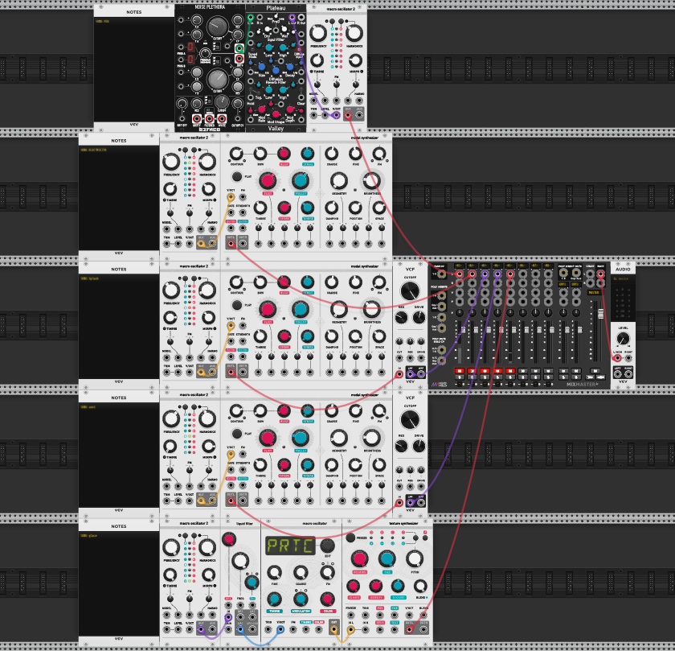

# prototype sonore
Les sons présent dans ce repository sont les démos des sons et musique qui vont jouer lors de l'interaction avec la table via les statuettes. Ces sons seront jouer dans max spat et leurs positions seront déterminer avec le patcher de Jacob. Les sons sont des éléments naturel qui vont jouer lorsque les statuettes vont créer des éléments naturel comme dans un sandbox. 
## plugins utilisés
- audible intruments
- valley
- -befaco

